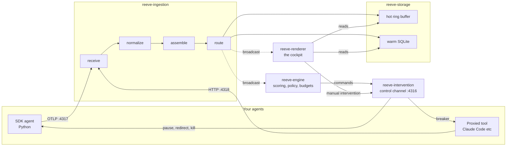

# Architecture

How Reeve is put together. The README says what it does; this page says
how, close enough to the code that every section names the crate that
owns it. The reasoning behind individual decisions lives in
[docs/adr/](adr/); this is the map that makes those decisions findable.

## The shape of the system

One binary runs all of it. `reeve` starts the ingestion listeners, the
engine, the control server, and the renderer as tasks in a single
process; the only external processes are your agents and, optionally,
Ollama for Tier 2 scoring.

## Five layers, eight crates

The README's five capabilities map onto the crates like this: **Watch**
is `reeve-ingestion` feeding `reeve-renderer`. **Score** and **React**
are `reeve-engine`. **Intervene** is `reeve-intervention` plus the agent
side in `reeve-sdk` and the Python SDK. **Learn** is the outcome
tracking in `reeve-engine` persisted through `reeve-storage`.
`reeve-model` holds the types they all speak, and `reeve` is the binary
that wires them together.

## How spans get in

Two paths, one pipeline.

**The SDK path.** An agent instrumented with the Python SDK (or any
OTel SDK) exports spans over OTLP to port 4317. The SDK also opens the
control channel on 4316 and calls `checkpoint()` at its safe yield
points, which is what makes commands like pause and kill enforceable
instead of advisory. The three adapters (LangChain, OpenAI Agents,
Claude Agent SDK) sit on top of this path and emit the spans so the
agent code does not have to.

**The proxy path.** Tools you cannot instrument, like Claude Code, get
pointed at port 4318 with one environment variable. The proxy forwards
every request to the real API, tees the stream, and synthesizes spans
from the traffic: request bodies become turn threading (consecutive
requests sharing a message prefix are one conversation), tool_use and
tool_result blocks become tool spans, and usage fields become token
counts. The proxy is also an enforcement point: a killed agent gets a
refusal with a named reason instead of a forwarded request.

## The ingestion pipeline

Four stages inside `reeve-ingestion`, connected by channels. Spans move
through them one way.

**receive** validates that what arrived is well-formed, deduplicates
spans that arrive twice, and stamps arrival metadata, including which
path the span came through. The control channel's NTP-style handshake
measures each agent's clock offset; receive carries that offset with
the span.

**normalize** translates wire formats into Reeve's internal span type.
Known `gen_ai.*` attributes are lifted into typed fields, everything
else is kept raw. The clock offset gets applied here, so timestamps
downstream are already aligned. Two policies live in this stage: the
privacy tier decides whether message content is stored at all, and
SDK spans that carry token counts but no cost get priced from the
built-in table, so adapters never ship price lists that drift.

**assemble** turns loose spans into trace trees. It threads parents to
children, holds spans whose parent has not arrived yet, and decides
when a trace is finished. Completion is keyed off the root span: when
the root lands, a 2-second window opens for stragglers, then the trace
finalizes. Quiet traces are handled by an idle timeout, but streaming
and paused agents are explicitly exempt, because a model
mid-generation and a paused agent are silent for good reasons.

**route** is the fan-out. Every span of a finalized trace goes to the
hot ring buffer, the trace and its spans and events are saved to the
warm tier in one transaction, and completion events go out on a
broadcast channel that the engine and the renderer both subscribe to.

## Storage: two tiers

`reeve-storage` keeps a hot tier and a warm tier. The hot tier is an
in-memory ring buffer sized for what the cockpit shows live. The warm
tier is SQLite in WAL mode, one file, no server, holding completed
traces for the History view, replay, cost aggregation, and the budget
resync. Retention prunes completed traces past a configurable age
(default 30 days), with two exemptions: running traces, and traces
that were intervened on, because commands and their outcomes are the
permanent record and they keep their referent.

## The engine

`reeve-engine` subscribes to the ingestion broadcast and scores what it
hears. Heuristic evaluators run on every trace: loop detection, cost
efficiency, latency normality, intent-action divergence, and deviation
from the agent's own fingerprint. If Ollama is running, an LLM judge
adds faithfulness, hallucination, and tool selection scores in the
background. Everything folds into the 0 to 100 health score.

The policy engine evaluates user rules (from `config.toml` and the
cockpit) against each scored trace and fires commands when conditions
match. Budgets live here too: a per-agent ledger settles real cost on
every completion, and every 30 seconds the ledger reconciles against
the warm store, taking the higher figure. The store hears everything
the pipeline kept over a lossless channel, while the engine's broadcast
subscription can drop events under load, so the resync is what makes a
budget cap trustworthy when the system is busiest.

## The intervention path

`reeve-intervention` runs the control server on port 4316 and the
dispatcher that owns command delivery. A command, whether a human
pressed `i` or a policy rule fired, gets queued, delivered at the
agent's next checkpoint, acknowledged in steps, and written to the
audit log. The audit log is append-only and survives retention. SDK
agents apply commands at their yield points; proxied agents get the
breaker, which refuses further API calls at the proxy. Paused agents
are marked in shared state that the assembler reads, so a paused
agent's silence is never finalized as an interrupted trace.

## The renderer

`reeve-renderer` is the cockpit: ratatui, one screen, keyboard only. It
reads the hot tier for the live view, queries the warm tier for
History, Cost, and replay, and issues interventions through the same
dispatcher as policies. It renders at 15fps while you interact, 5fps
idle, 1fps unfocused, and any keypress snaps it back instantly. If the
render loop ever lags the ingestion broadcast, it drops stale frames
and rebuilds from current state instead of replaying a backlog.

## Invariants

The rules the crates hold each other to. Each one earned its place.

**The root span emits last.** All three integration paths end their
root after every child: the proxy's turn root, the OpenAI adapter's
run umbrella, the Claude adapter's session root. Completion is keyed
off the root, so root-last makes completion mean what it says: when
the straggler window opens, the work is already in.

**A span that entered the pipeline reaches storage.** Every container
the assembler holds spans in is enumerated by every path that
finalizes a trace, including timeouts and disconnects. This invariant
was bought with the worst bug in the project's history, where a flush
path iterated a different container than the happy path and spans
vanished silently.

**Budgets never trust the broadcast alone.** The lossy channel is for
liveness; the store is for truth. Settled spend is rebuilt from SQLite
on a cadence, and the reconciliation takes the higher number, because
a spend cap that undercounts is worse than none.

**Privacy fails closed.** Content capture is off unless the config
says otherwise, unparseable config means tier 1, and enabling capture
writes a consent line to an audit file. The scanner that looks for
outbound secrets reports kind and fingerprint, never the secret.

**The permanent record is permanent.** Interventions, outcomes, and
the audit log survive both retention and trace deletion. Telemetry is
disposable; what the operator and the policies did is not.

## Source map

| Crate | Owns |
|---|---|
| `reeve-model` | Entities, IDs, signals. The vocabulary every other crate speaks. |
| `reeve-ingestion` | OTLP receiver, HTTP proxy, the four pipeline stages, pricing, secret scanning. |
| `reeve-storage` | Hot ring buffer, warm SQLite tier, migrations, retention. |
| `reeve-engine` | Heuristic evaluators, LLM judge, health score, policy engine, budgets, outcome tracking. |
| `reeve-intervention` | Control server, command dispatcher, audit log. |
| `reeve-renderer` | The cockpit: panels, keybindings, replay, adaptive render cadence. |
| `reeve-sdk` | Rust SDK: control channel client, checkpoints. |
| `sdk/python` | Python SDK (`reeve-sdk` on PyPI): `ReeveSdk`, the three adapters. |
| `reeve` | The binary. Wires everything, owns startup, ports, and retention scheduling. |

Ports, for reference: 4317 OTLP ingestion, 4318 HTTP proxy, 4316
control channel. All loopback only.
